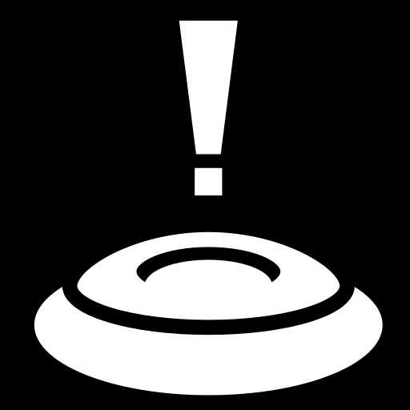

# Minesweeper

---

## Dates: 7/1/2022 - 7/8/2022

---

### **_Project Links_**

[Trello](https://trello.com/invite/b/SmlDjLZn/06fb2aaf3f96c9f70fb4c217412c0d45/ga-project-1) | [Surge deployment](https://pks-minesweeper.surge.sh/)

### **_My Links_**

[LinkedIn](https://www.linkedin.com/in/patrick-f-knight/) | [Github](https://www.github.com/pfknight8)

---

## **_Description_**

#### This project constitutes my version of the classic game Minesweeper. This is my first project for General Assembly SEI course, constructed over the course of 1 week. It was a fun exersice piecing this game together from scratch using only HTML, JavaScript, & CSS, and was a great way to get more familiar with coding in these languages.

#### The object of the game is to clear the board of tiles without activating any hazards. Use the numbers displayed in the tiles you have cleared to determine where the nearby hazards may be, then mark them with a "flag."
#### Once all the hazards have been properly marked and the rest of the game tiles cleared, you'll have won the game...but if you activate any one of the hazards, you'll lose, and will have to start a new game.
#### Win or lose, if you wish to play again, simply click on one of the level select buttons and a new minefield will appear.

---

## **_Screenshots_**

#### Main Page.

#### Expanded information section (collapsed in the prior photo).

#### A game in progress.

---

## **_Future Updates_**

#### Some things to consider if I have time to come back to this after the course.

- [x] ~~Include interface to show count of flags vs bombs.~~
- [x] ~~Provide choice of game level.~~
- [x] ~~Make Information section collapsibile.~~
- [ ] Add ability to make custom sized board & number of "mines."
- [ ] May update icons & other symbols used.
- [ ] Optimized for mobile.

---

## **_Credits_**

#### Credit for advice/examples on how to approach this project, as well as the art files I used in the project.

- #### For grid images, game-icons.net (user Lorc).
- #### imgur.com for background picture (user Wadatahmydamie).
- #### Mine sound effects from Media College.com: https://www.mediacollege.com/downloads/sound-effects/
- #### For some helpful coding ideas, github user kubowania's minesweeper was worth a review: https://github.com/kubowania/minesweeper/blob/master/app.js